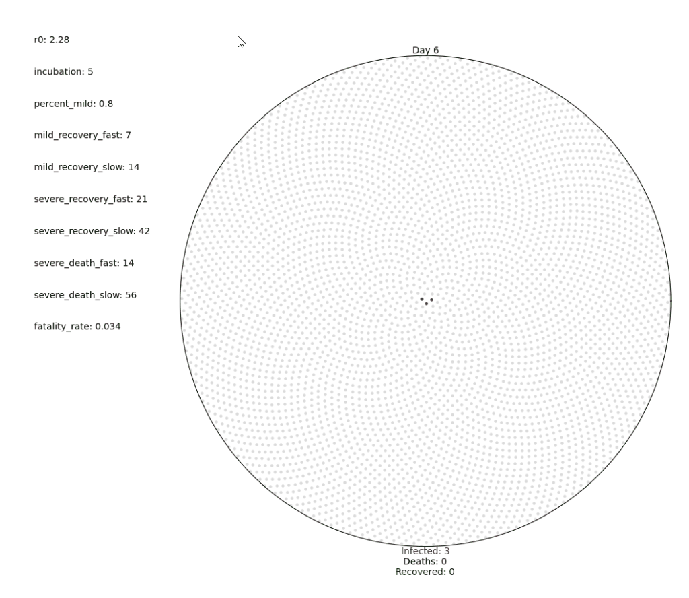

# Pandemic Simulator

A simple model of a virus spreading over a population.

Inspired by the visuals presented here: https://www.washingtonpost.com/graphics/2020/health/coronavirus-how-epidemics-spread-and-end/

**Used technologies:** *Python, Matplotlib, NumPy*

## How to Use

Run main.py. When prompted, either use the default COVID-19 paramters or enter custom parameters that describe the virus's spread. The simulation will begin when the parameters are set.

### Requirements

* Python
* Matplotlib (and dependencies)
* Numpy (and dependencies)

## License

This project is licensed under the MIT License - see the LICENSE.md file for details
